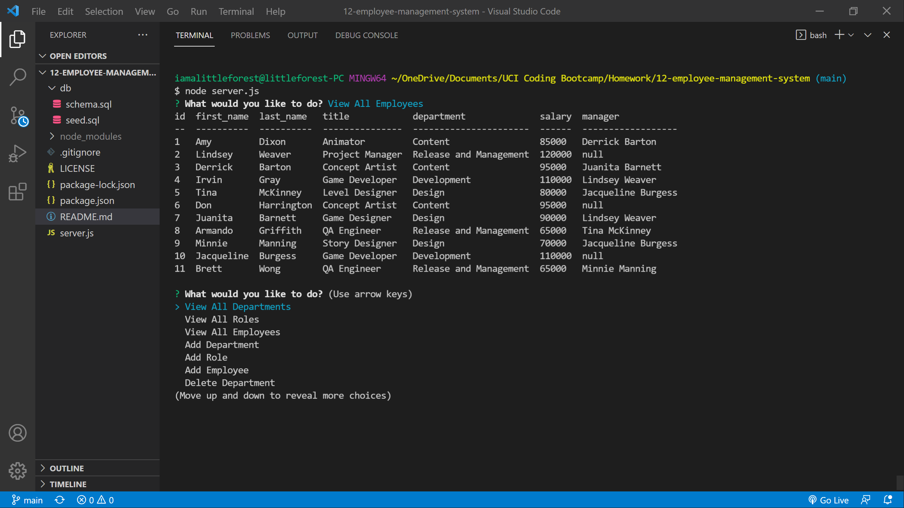

# Employee Management System

## Languages & Technologies
* Javascript
* MySQL Workbench
* Node.js
* Inquirer Package
* MySQL2 Package
* Console.table Package

## Description
An application that can be used to manage a company's employees.

## Screenshot

## Demo
[Walkthrough Video](https://iamalittleforest.github.io/12-employee-management-system/assets/images/README-walkthrough.mp4)

## License
MIT License

## Contact Information
Wendy Kobayashi (<wykobayashi@gmail.com>)